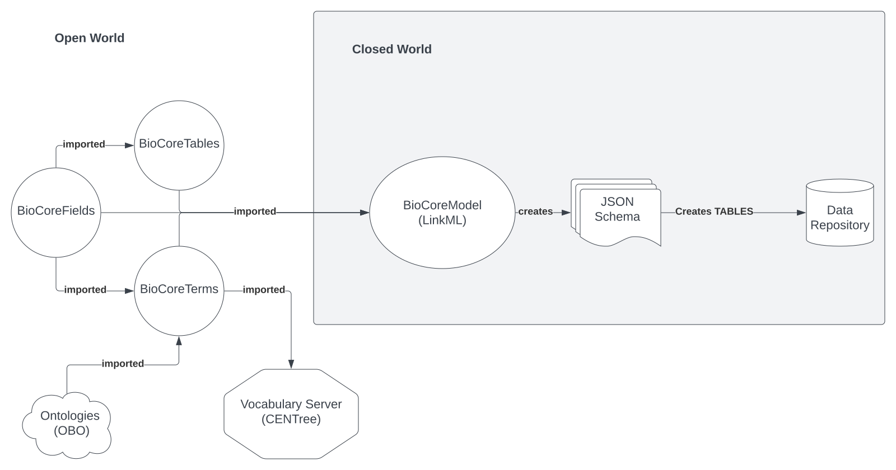

# README FOR BIOCORE

All in one readme--no digging through the directory tree to find more docs--its all here.

BioCore Data Model is *not a* schema, but it contains tools for generating them using LinkML and YAML files (the data model). The YAML files are the data model, the schema it generates are JSON files. We do provide a collection of test schema, so if you are looking for a schema to start with, check the `json_schema` directory to determine if BioCore will be useful for your application.

The Turtle/RDF ontology (OWL2) files are collections of *vocabularies*, and there are three:

   1. The BioCoreFields ontology, which is the core of the BioCore data model, and is the basis for the other two vocabularies. This is simply a list of Fields or Attributes, basically names of things and their definitions. Data types are specified later. Not only are there definitions of each type of Data Column (Field), there are also pointers to other standard ontologies selected in BioCore. If you are labeling a columnar data file like Parquet, this is all you need to use.
   2. The BioCoreTables ontology. Much smaller than the other two, is a list of classes that describe, oddly enough, Tables. These are the recommended names of *things* you might have in a dataset like patients (Donors) or tissue samples (BioSamples). Note that all of the classes in BioCoreTables are purposefully *singular*. If you want to describe about a _populated_table_ (not just the metadata labels for the table), then you should use the LinkML code and make a container there that you can validate against. If you just want to know what to name your tables, use this. We also provide a collection of synonyms for popular tables so you can find the closest match in BioCoreTables. There is a vocabulary server that will let you run elasticsearch over the vocabularies to find what you need (CENTree, Broad Internal).
   3. The BioCoreTerms ontology. Last of the three, and ultimately the biggest. This is the lists of all the *things* that we recommend you use to label data with. We leave it to the professional ontologists build the best in class ontologies on OBO, and select the most appropriate for labelling based on the needs of the Broad Data Sciences Platform Ingest Team. We only deeply model 2 Terms out of necessity: 

   * DataModality (Transcriptomic, Genomic, RibosomeProfile, Epigenetic-Methylation, etc...) which is generally a good label for a whole table (though it is easy to make a column of them if you have a table where the modality does vary with a few lines of LinkML). This is a qualitative descriptor of *what* the topic of study is, not the method. So it should be pretty high level and we have collected a vocabulary based on work at the Broad Genomic Platform. The other is the 
   * SampleType (Tumor, Normal, CellLine, etc...) which is also a good label for a whole table because its easy to keep samples separated. If the samples use pooling, again you will have to describe that in the schema. This is useful for describing *what* the object of study is, is it DNA, a biopsy, white blood cells, etc. While there are ontologies that describe these things in detail, we have found nothing which captures "samples I might see in a BioMedical lab" so we provide this.
   * There are a few other small things we model (like classify subject Age into classes like AgeAtObservation or AgeAtDeath, along with the very important AgeUnits property to separate units from values), but these are all little things just to make it easier to use the OBO ontologies. 
You can find the list of these ontologies on the  TerraCore page, the BioCoreTerms onlogy is a guide to using them: which terms go in which columns (Fields).

[https://github.com/DataBiosphere/terra-interoperability-model/blob/master/documents/Ontologies.md]

Besides these three files, there is the supplementary TerraDCATAP ontology, which is Terra specific Application Program of the data catalogue ontology DCAT2. While Terra specific, it may be useful for terms used for your DataBase indexing and searching system, and for labelling the datasets themselves.

The LinkMl code is *not complete*, it is a working prototype that we plan to make rapid improvments on as soon as we have put some schema into production. We are working on a few things:
   * The cannonical Donor data model: who did the data come from.
   * The cannonical Sample data model: what did they collect, and its child BioSample which has extra fields that are specific to the sample type.

## Code organization

Generally files are organized by type, Ontology (OWL/TTL) go in the `rdf` directory, YAML data models go in the `linkml` directory, JSON Schema into the `json_schema` directory, etc. Note that there are some symbolic links, like in the external `tools` directory back to this directories, to make file i/o more intuitive and not have to remember the whole directory structure.

## TODO

 * write the canonical models with comments, they are stripped out in the JSON files. Here is where datatypes are written, and the cardinality of the Fields.
 * Import the BioCore ontology (vocabulary) files into the LinkML code, so that the code can be used to validate the data model and build schema.
 * Create a test set and compare against the AnVIL Findability Subset. This target schema was created by the BioCore Team, explicity to be the first test of BioCore (v1.0 GOAL).

### LinkML installation / setup

By far the easiest way to set up LinkML is to use pip, in debianish linux this is one line (but easy on any OS):

`sudo apt install python3-pip`

There are additional tools in the schema-automator and schemasheets packages for converting to/from ontology files and spreadsheets.

Set up an environment (venv is optional?):

`mkdir linkml-biocore
cd linkml-biocore
python3 -m venv venv
source venv/bin/activate
pip install linkml`

OPTIONAL: There are lots of command line tools and files being generated here, if you don't completely love the command line you might consider using VSCODE (by Microsoft corporation (if you don't already)) for both the file browser and the terminal interactions, along with extensions for viewing TTL ontology and YAML data model files. It is a very fine software that will do everything we need here.

Test installation:

`linkml-convert --help`

Test JSON schema creator, get a YAML model file (like from the `example_yaml` directory):

https://github.com/DataBiosphere/biocore-data-model/blob/main/content/linkml/subject.yaml

and make schema:

`gen-json-schema subject.yaml`

Make a YUML file (class diagram):

https://yuml.me/diagram/nofunky;dir:TB/class/[Container]++-%20donors%200..*%3E[Donor|id:string;full_name:string;xref_id:string%20*;birth_date:date%20%3F;death_date:date%20%3F;death_age:integer%20%3F;reported_ethnicity:string%20%3F;genetic_ancestry:string%20%3F;organism_type:string%20%3F;phenotypic_sex:string%20%3F;strain:string%20%3F],[Container]

### Exporting ontologies to LinkML

The process is to use *robot* to generate ofn files then to convert these into YAML for LinkML to import.

### Simple example (POC)

For this example we are just going to turn 3 classes into tables: Sample, Donor, and Activity. These are defined in the 'mini-ontology' `BioCoreTables-min3.ttl`.

`./robot convert -i rdf/BioCoreTables-min3.ttl -o ofn/BioCoreTables-min3.ofn`

*robot* has 3 levels of verbosity beyond the default, if you want to see everything that just happened (with lots of DEBUG, INFO, and WARN statements):

`./robot convert -vvv -i rdf/BioCoreTables-min3.ttl -o ofn/BioCoreTables-min3.ofn`

Now we use scheauto to translate the ofn into LinkML compatible YAML:

`schemauto import-owl ofn/BioCoreTables-min3.ofn`

Export it to a YAML file like:

`schemauto import-owl ofn/BioCoreTables-min3.ofn > linkml/BioCoreTables-min3.yaml`

Questions/TODO

   * Resolve all the punning errors from skos / prov etc.
   * fix BioCore prefix going to `wid.org/None`
   * Why does `prov:Activity` get converted into `Activity` by schemauto? Is the `:` getting tokenized in some weird way?
      * ERROR:root:Overwriting class_uri for {'class_uri': 'http://www.w3.org/ns/prov#Activity'} to BioCore:Activity
   * skos and prov definition conflict
      * ERROR:root:Overwriting slot_uri for {'slot_uri': 'http://www.w3.org/2004/02/skos/core#definition'} to http://www.w3.org/ns/prov#definition
      * Is there a way to pull definitions (either one) into the linkml yaml?

### Full BioCore export process (for release)

Fields 

`./robot convert -i rdf/BioCoreFields.ttl -o ofn/BioCoreFields.ofn`

`schemauto import-owl ofn/BioCoreFields.ofn > linkml/BioCoreFields.yaml`

Tables

`./robot convert -i rdf/BioCoreTables.ttl -o ofn/BioCoreTables.ofn`

`schemauto import-owl ofn/BioCoreTables.ofn > linkml/BioCoreTables.yaml`

Terms

`./robot convert -vvv -i rdf/BioCoreTerms.ttl -o ofn/BioCoreTerms.ofn`

`schemauto import-owl ofn/BioCoreTerms.ofn > linkml/BioCoreTerms.yaml`

Questions/TODO/Someday

   * rangeIncludes and hasVersion overwrites
      * ERROR:root:Overwriting slot_uri for {'slot_uri': 'http://purl.org/dc/dcam/rangeIncludes'} to http://schema.org/rangeIncludes
      * ERROR:root:Overwriting slot_uri for {'slot_uri': 'http://purl.org/dc/terms/hasVersion'} to https://datamodel.terra.bio/BioCore#hasVersion
   * Unknown errors from schemaauto:
      * ERROR:root:TODO
      * weird dots (progress bar) at the beginning of output
   * Is there a way to pull in a model description from OWL?
   * Need to turn off     multivalued: true for prefLabel